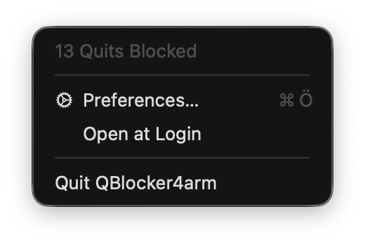
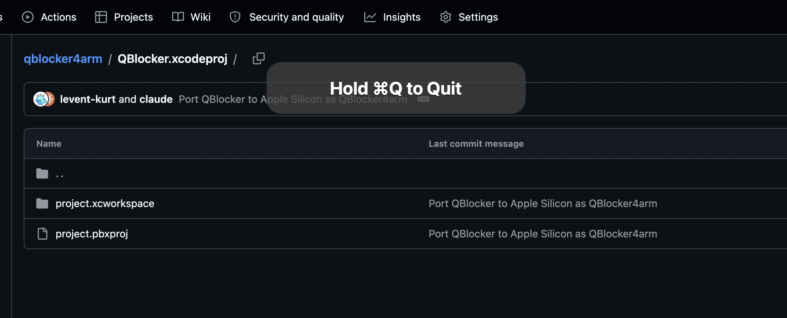
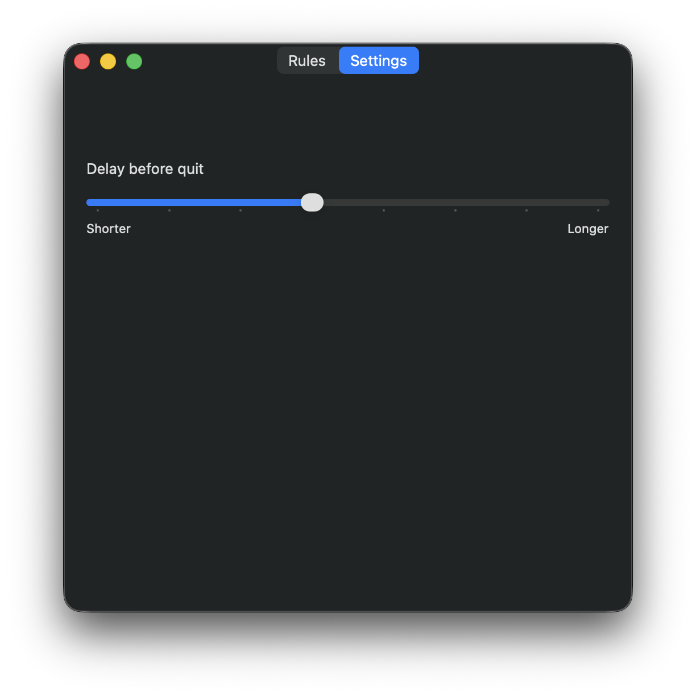
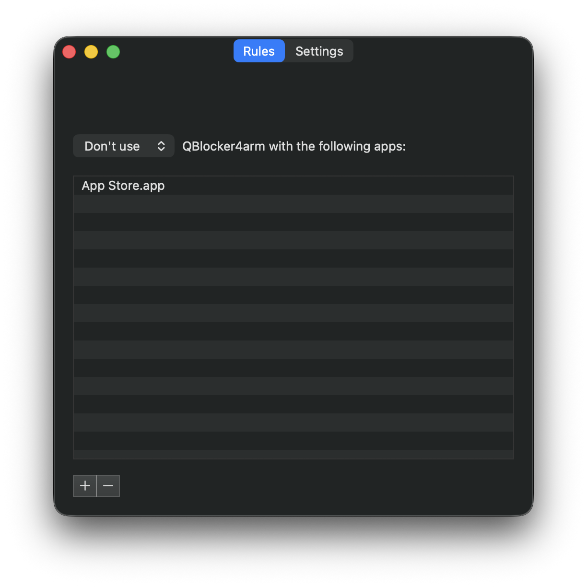

# QBlocker4arm

QBlocker4arm stops you from accidentally quitting an app when you actually meant to close the window. It works by blocking the default CMD + Q keyboard shortcut and forcing you to hold it down to quit.

This is an Apple Silicon (arm64) port of [Stephen Radford](https://github.com/steve228uk)'s original [QBlocker](https://github.com/steve228uk/QBlocker) — all credit for the idea, design, and original implementation goes to him. Huge thanks for building and open-sourcing it in the first place.

## Why this fork exists

Apple has [confirmed that macOS 27 will be the final release to support Rosetta](https://developer.apple.com/news/?id=w5ngl9k2), the compatibility layer that lets Intel-only apps run on Apple Silicon Macs — after that, Intel-only apps stop working entirely. Starting with macOS 26.4, the system already warns you when launching an app that relies on Rosetta.

QBlocker's original 2016 codebase (Swift 2, CocoaPods, and dependencies that predate Apple Silicon by years) couldn't be recompiled as-is on modern Xcode, so this fork is a full port to a native, dependency-free, arm64-only build.

## What changed from the original

- Migrated the entire codebase from Swift 2 to modern Swift 5
- Removed all third-party dependencies (DevMateKit, RealmSwift, SRTabBarController) — the app is now pure AppKit/Foundation
  - Analytics/auto-update (DevMateKit, long since discontinued) removed entirely
  - Excluded-apps storage moved from Realm to a small `Codable`/JSON store
  - The custom tab bar UI replaced with AppKit's native `NSTabViewController`
- Dropped CocoaPods in favor of no dependency manager at all
- Replaced the legacy, now crash-prone `LSSharedFileList` Login Items API with the modern `SMAppService`
- Fixed the "Open System Preferences" flow for the current System Settings app (the old AppleScript pane-reveal approach no longer works)
- Added an installer-style permissions checklist — the app now also requests **Input Monitoring**, a separate permission from Accessibility introduced in macOS Catalina that's required for the keyboard event tap to actually receive events (missing it left CMD+Q silently unblocked with no error)
- Made the event tap itself more robust: recovers automatically if macOS disables it for responding too slowly, and no longer does synchronous disk reads or AX menu-tree lookups on the hot path of every keystroke
- Offers to move itself to `/Applications` on first run if launched from elsewhere (e.g. Downloads), avoiding macOS's App Translocation
- Project now builds `arm64` only, targeting macOS 13+

## Download

Grab the [latest release (v1.2, arm64)](https://github.com/levent-kurt/qblocker4arm/releases/latest) directly, or browse the [Releases page](https://github.com/levent-kurt/qblocker4arm/releases).

Since this build isn't notarized, macOS Gatekeeper will flag it on first launch — right-click (or Control-click) the app and choose **Open** to run it anyway. If that doesn't work (recent macOS versions often skip straight to "Not Opened" with no Open Anyway option), run this in Terminal instead:

```bash
xattr -cr ~/Downloads/QBlocker4arm.app
```

On first launch it'll offer to move itself to `/Applications` (open it again from there afterward), then walk you through granting Accessibility and Input Monitoring — both are required for it to actually intercept CMD+Q. macOS may also show its own native "would like to receive keystrokes" prompt the first time; that's normal, just send it to System Settings (or ignore it and use the app's own window instead) — either way works.

## Contributing

Any contribution is welcome whether it's reporting bugs, helping with design, fixing typos or getting stuck in with development.

## Screenshots

### Menu Bar Menu



### Quit Message Demonstration



### Preferences — Rules



### Preferences — Settings


